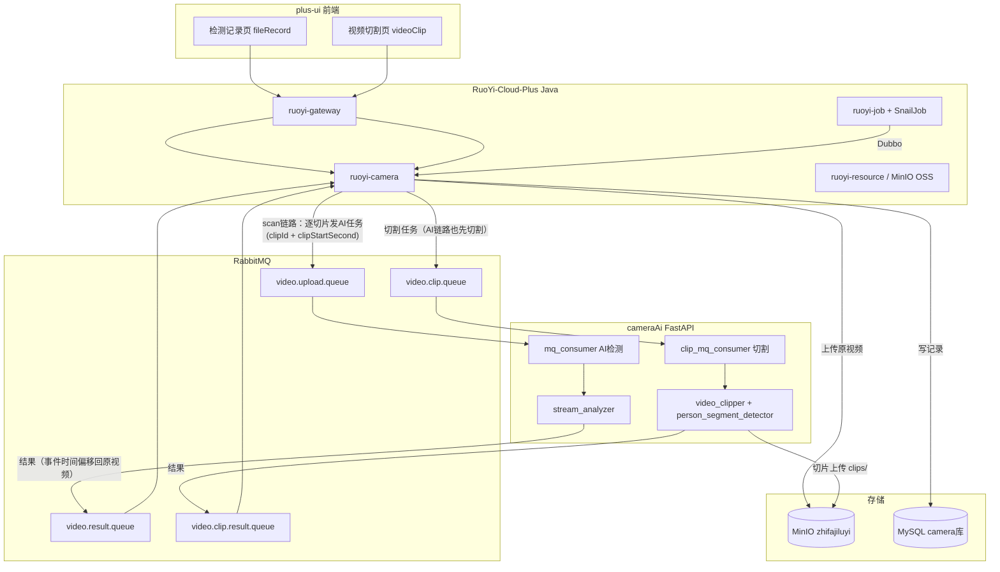
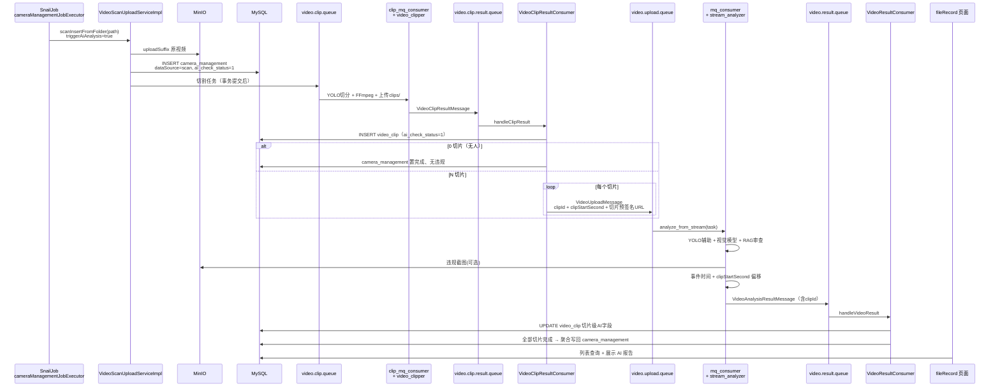
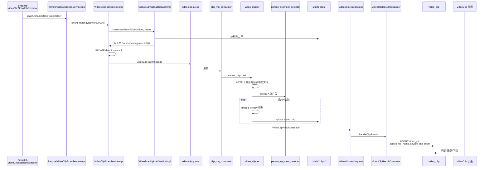

# 执法视频 AI 检测与视频切割 — 系统开发逻辑文档

> 本文档面向开发与运维人员，详细描述本系统在 **AI 违规检测** 与 **视频人体切割** 两条业务链路上的实现逻辑、模块分工、消息协议与关键源码位置。  
> 涉及三个工程：
>
> | 工程 | 路径 | 职责 |
> |------|------|------|
> | RuoYi-Cloud-Plus | `d:\IdeaProject\RuoYi-Cloud-Plus` | Java 微服务后端（camera / job）、网关、SnailJob |
> | cameraAi | `d:\PycharmProject\cameraAi` | Python FastAPI AI 服务（YOLO + 大模型 + FFmpeg） |
> | plus-ui | `d:\IdeaProject\plus-ui` | Vue3 前端管理页面 |

---

## 目录

1. [系统总览](#1-系统总览)
2. [技术栈与部署拓扑](#2-技术栈与部署拓扑)
3. [核心数据库设计](#3-核心数据库设计)
4. [RabbitMQ 消息拓扑](#4-rabbitmq-消息拓扑)
5. [AI 视频违规检测 — 完整实现逻辑](#5-ai-视频违规检测--完整实现逻辑)
6. [视频人体切割 — 完整实现逻辑](#6-视频人体切割--完整实现逻辑)
7. [两条链路的对比与隔离](#7-两条链路的对比与隔离)
8. [SnailJob 定时任务](#8-snailjob-定时任务)
9. [前端页面逻辑](#9-前端页面逻辑)
10. [配置清单](#10-配置清单)
11. [运维与排错](#11-运维与排错)

---

## 1. 系统总览

本系统围绕 **执法记录仪长视频** 提供两类异步 AI 能力。**视频切分作为 AI 检测的前置预处理**：扫描入库后先用 YOLO 切出「有人」短片段，再逐片送大模型检测，最后将各切片结果聚合写回原视频记录，从而避免对 20 分钟长视频直接跑大模型。

| 能力 | 业务目标 | 触发方式 | 结果落库 |
|------|----------|----------|----------|
| **AI 违规检测（含切分预处理）** | 扫描入库 → 切分有人片段 → 逐片大模型检测 → 聚合报告与截图 | `cameraManagementJobExecutor` 扫描后自动串联（`triggerAiAnalysis=true`） | 切片级 `video_clip`，聚合后 `camera_management` |
| **纯视频人体切割** | 仅用 YOLO 找出「有人」片段，FFmpeg 切成短视频上传 MinIO（**不触发 AI**） | `videoClipScanJobExecutor` 定时扫描 + 发切割 MQ | `video_clip` |

### 1.1 总体架构图



### 1.2 设计原则

1. **异步解耦**：Java 负责业务编排与持久化，Python 负责重计算；两者通过 RabbitMQ JSON 消息通信。
2. **预签名 URL 传视频**：Python 不直接访问 NAS 路径，而是通过 MinIO **7 天**预签名 URL 下载/流式读取视频。
3. **事务后发 MQ**：原视频扫描入库、切片落库均在事务提交后再发送下游消息（`TransactionSynchronization.afterCommit`），避免脏读。
4. **切分作为 AI 预处理**：AI 检测链路（`dataSource=scan`）扫描入库后**先发切割任务**，切片落库后自动逐片发 AI 任务，事件时间按 `clipStartSecond` 偏移回原视频时间轴，全部切片完成后聚合写回 `camera_management`。
5. **双链路用 `dataSource` 区分**：`scan` → 切完自动逐片 AI；`clip`（纯切割定时任务）→ 切完即止，不触发 AI。

---

## 2. 技术栈与部署拓扑

### 2.1 后端（Java）

| 组件 | 说明 |
|------|------|
| Spring Boot 3 + RuoYi-Cloud-Plus | 微服务框架 |
| MyBatis-Plus | ORM，`camera_management` / `video_clip` |
| Dubbo 3 | `ruoyi-job` 调用 `ruoyi-camera` 的扫描服务 |
| Spring AMQP | RabbitMQ 生产者/消费者 |
| SnailJob | 分布式定时任务（扫描文件夹） |
| OSSFactory / OssClient | 封装 MinIO 上传与预签名 URL |

### 2.2 AI 服务（Python）

| 组件 | 说明 |
|------|------|
| FastAPI | HTTP + 生命周期管理（启动 MQ 消费者） |
| aio_pika | 异步 RabbitMQ 客户端 |
| ultralytics YOLO | 人体检测（切割）/ 辅助检测（AI 流程可选） |
| OpenAI 兼容 API | 视觉大模型（hrylora）+ 思考模型（Qwen3-Thinking） |
| FFmpeg | 视频切割 `-c copy` |
| minio Python SDK | 切片与违规截图上传 |

### 2.3 典型进程清单

| 服务 | 端口（示例） | 必须 |
|------|-------------|------|
| ruoyi-gateway | 8080 | 是 |
| ruoyi-auth / system / resource | — | 是 |
| **ruoyi-camera** | 9205（示例） | 是 |
| **ruoyi-job** | — | 切割/扫描定时任务需要 |
| **cameraAi FastAPI** | 8000 | 是 |
| RabbitMQ | 5672 | 是 |
| MinIO | 9000 | 是 |
| Nacos | 8848 | 是 |

---

## 3. 核心数据库设计

### 3.1 `camera_management` — 执法视频主表

存储原视频元数据、AI 检测结果、复判信息。

| 字段 | 类型 | 说明 |
|------|------|------|
| `video_id` | BIGINT PK | 视频 ID |
| `serial_number` | VARCHAR | 从文件名解析的序列号 |
| `user_name` / `user_code` | VARCHAR | 执法人员信息 |
| `storage_location` | VARCHAR | **原始文件路径**（NAS UNC 或本地路径，用于展示文件名） |
| `oss_id` | BIGINT | 关联 `sys_oss`，原视频在 MinIO 的记录 |
| `data_source` | VARCHAR | 数据来源字典 `camera_data_source`：`scan` / `clip` / `manual` 等 |
| `ai_check_status` | BIGINT | **0 未检测 / 1 检测中 / 2 完成 / 3 失败** |
| `ai_check_result` | JSON/TEXT | AI 分析报告（JSON 包装） |
| `has_violation` | INT | 0 正常 / 1 违规 |
| `violation_type` | VARCHAR | 违规类型 |
| `violation_start_second` / `violation_end_second` | DOUBLE | 违规时间段 |
| `screenshot_url` | VARCHAR | 违规截图 MinIO URL |
| `process_time` | DOUBLE | AI 处理耗时（秒） |
| `check_time` | DATETIME | 检测完成时间 |

**实体类：** `ruoyi-modules/ruoyi-camera/.../domain/CameraManagement.java`

### 3.2 `video_clip` — 视频切片表

存储切割后的短视频片段，一行代表一个片段。

| 字段 | 类型 | 说明 |
|------|------|------|
| `clip_id` | BIGINT PK | 切片 ID |
| `task_id` | VARCHAR | 切割任务 ID，格式 `CLIP-{videoId}-{timestamp}` |
| `video_id` | BIGINT | 关联原视频 |
| **`source_file_name`** | VARCHAR | **原视频文件名**（持久化，页面展示） |
| **`source_clip_count`** | INT | **该次切割产出的有效片段总数** |
| `clip_index` | INT | 片段序号，从 0 开始 |
| `object_name` | VARCHAR | MinIO 对象路径，如 `clips/2026/05/27/clip_123_0_xxx.mp4` |
| `url` | VARCHAR | 7 天预签名 URL（可过期，播放前会刷新） |
| `start_second` / `end_second` / `duration_seconds` | DOUBLE | 片段时间信息 |
| `file_size` | BIGINT | 字节 |
| `clip_status` | TINYINT | 0 处理中 / 1 完成 / 2 失败 |
| **`ai_check_status`** | TINYINT | **切片级 AI 状态：0 待检测 / 1 检测中 / 2 完成 / 3 失败** |
| `ai_has_violation` | TINYINT | 切片是否违规（0 无 / 1 有） |
| `ai_violation_type` | VARCHAR | 切片违规类型 |
| `ai_description` | TEXT | 切片 AI 分析描述 |
| `ai_events_json` | TEXT | 切片事件列表 JSON（时间已偏移到原视频时间轴） |
| `ai_screenshot_url` | VARCHAR | 切片违规截图 URL |
| `ai_violation_start_second` / `ai_violation_end_second` | DOUBLE | 切片违规起止秒（原视频时间轴） |
| `ai_process_time` | DOUBLE | 切片 AI 处理耗时（秒） |
| `ai_error_message` | VARCHAR | 切片 AI 检测失败信息 |

**DDL：**
- 建表：`script/sql/add_video_clip.sql`
- 增量字段：`script/sql/update_video_clip_source_info.sql`
- 切片级 AI 字段：`script/sql/add_video_clip_ai_fields.sql`

**实体类：** `ruoyi-modules/ruoyi-camera/.../domain/VideoClip.java`

### 3.3 `sys_oss` — 文件存储记录

扫描上传时 Java 侧写入，`camera_management.oss_id` 关联此表，用于生成预签名 URL。

---

## 4. RabbitMQ 消息拓扑

Java 端统一在 `VideoMqConfig.java` 声明 Exchange / Queue / Binding；Nacos `application-common.yml` 配置连接与 routing key。

### 4.1 四套队列总览

| 方向 | Exchange | Queue | Routing Key | 生产者 | 消费者 |
|------|----------|-------|-------------|--------|--------|
| Java → Python（AI 任务） | `video.upload.exchange` | `video.upload.queue` | `video.upload.task`（Java 发送侧） | `VideoMessageServiceImpl` | Python `mq_consumer` |
| Python → Java（AI 结果） | `video.result.exchange` | `video.result.queue` | `video.result.finish` | Python `result_publisher` | Java `VideoResultConsumer` |
| Java → Python（切割任务） | `video.clip.exchange` | `video.clip.queue` | `video.clip.task` | `VideoClipMessageServiceImpl` | Python `clip_mq_consumer` |
| Python → Java（切割结果） | `video.clip.result.exchange` | `video.clip.result.queue` | `video.clip.result.finish` | Python `clip_result_publisher` | Java `VideoClipResultConsumer` |

> **注意：** Python 消费侧绑定 routing key 使用通配符 `video.upload.#` / `video.clip.#`，与 Java 精确 key 兼容（Topic Exchange）。

> **切分预处理扩展字段：** AI 任务消息 `VideoUploadMessage` 新增 `clipId`（切片 ID）与 `clipStartSecond`（切片在原视频中的起始秒）；AI 结果消息 `VideoAnalysisResult` 新增 `clipId`。`clipId` 为空表示整段视频直发（演示页/历史消息），非空表示切片级检测。

### 4.2 队列参数（与 Python 端必须一致）

**AI 任务队列 `video.upload.queue`：**
- `x-dead-letter-exchange: ""`
- `x-dead-letter-routing-key: video.upload.queue.dlq`
- `x-max-length: 10000`

**切割任务队列 `video.clip.queue`：**
- 死信队列：`video.clip.queue.dlq`
- `x-max-length: 1000`

**Java 配置类关键片段：**

```java
// ruoyi-modules/ruoyi-camera/.../config/VideoMqConfig.java

@Bean
public Queue videoUploadQueue() {
    return QueueBuilder.durable(videoUploadQueue)
        .withArgument("x-dead-letter-exchange", "")
        .withArgument("x-dead-letter-routing-key", videoUploadQueue + ".dlq")
        .withArgument("x-max-length", 10000)
        .build();
}

@Bean
public Queue videoClipQueue() {
    return QueueBuilder.durable(videoClipQueue)
        .withArgument("x-dead-letter-exchange", "")
        .withArgument("x-dead-letter-routing-key", videoClipQueue + ".dlq")
        .withArgument("x-max-length", 1000)
        .build();
}
```

### 4.3 消息序列化

- Java：`Jackson2JsonMessageConverter` + `JavaTimeModule`，字段 **camelCase**
- Python：Pydantic 模型 `alias` 映射 camelCase ↔ snake_case

---

## 5. AI 视频违规检测 — 完整实现逻辑

### 5.1 业务目标

对执法记录仪 **完整长视频** 进行「切分预处理 + 逐片 AI 分析 + 聚合」：
1. 扫描入库后先发切割任务，YOLO 切出「有人」短片段（无人部分不进大模型，节省算力）
2. 每个切片单独送视觉大模型，输出结构化事件 JSON（含起止时间、元数据）
3. RAG 规章制度匹配 + Thinking 模型二次审查
4. 违规时截取关键帧上传 MinIO（按切片内相对时间抓帧）
5. 事件时间按 `clipStartSecond` 偏移回 **原视频时间轴**，切片级结果落 `video_clip`
6. 该视频全部切片完成后聚合写回 `camera_management`，前端「检测记录」页展示

### 5.2 端到端时序



### 5.3 Java 端：扫描入库与切割预处理

#### 5.3.1 入口

| 入口 | 类 | 说明 |
|------|-----|------|
| SnailJob 定时 | `CameraManagementJobExecutor` | `cameraManagementJobExecutor`，扫描 `D:\执法记录仪` |
| Dubbo | `RemoteCameraServiceImpl` | 暴露 `ICameraManagementDubboService.scanInsertFromFolder` |
| 手动/API | `CameraManagementController` | 管理端上传或导入 |

#### 5.3.2 扫描上传核心逻辑

**文件：** `VideoScanUploadServiceImpl.java`

```java
@Override
public List<CameraManagement> scanInsertFromFolder(String folderPath) {
    return scanInsertFromFolder(folderPath, true);  // 默认走切分预处理 + AI
}

@Override
public List<CameraManagement> scanInsertFromFolder(String folderPath, boolean triggerAiAnalysis) {
    // 1. Files.walk 递归扫描 .mp4/.avi/... 
    // 2. 与 DB 已有 storage_location 去重
    // 3. 逐文件 processAndUploadSingleVideo(filePath, triggerAiAnalysis)
}

public CameraManagement processAndUploadSingleVideo(String filePath, boolean triggerAiAnalysis) {
    // 1. 构建 CameraManagement（解析文件名→序列号/用户/拍摄时间，读取时长）
    // 2. 复制到临时文件 → OssClient.uploadSuffix() 上传 MinIO
    // 3. if (triggerAiAnalysis) entity.setAiCheckStatus(1L);  // 检测中
    //    INSERT camera_management + sys_oss
    // 4. if (triggerAiAnalysis) sendClipPreprocessTask(...)   // 发切割任务（不再直发 AI）
    //    else 跳过
}
```

**发切割任务（事务提交后）：**

```java
private void sendClipPreprocessTask(CameraManagement camera, UploadResult uploadResult, OssClient ossClient) {
    if (TransactionSynchronizationManager.isSynchronizationActive()) {
        TransactionSynchronizationManager.registerSynchronization(new TransactionSynchronization() {
            @Override
            public void afterCommit() {
                doSendClipTask(...);  // 生成 7 天 presignedUrl → videoClipMessageService.sendClipTask
            }
        });
    } else {
        doSendClipTask(...);
    }
}
```

> 整段直发 AI 的 `sendVideoDetectionMessage` 仍保留在 `VideoMessageServiceImpl` 中（演示页同步分析等场景），但扫描链路已不再调用。

#### 5.3.3 切片落库后逐片派发 AI 任务

**文件：** `consumer/VideoClipResultConsumer.java`

切割结果回传后，消费者根据 `camera_management.data_source` 区分链路：

```java
private void handleSuccess(VideoClipResult result) {
    CameraManagement camera = cameraManagementMapper.selectById(result.getVideoId());
    boolean scanChain = isScanChain(camera);   // dataSource == "scan"

    if (clips.isEmpty()) {
        if (scanChain) completeWithoutClips(videoId);  // 无人 → 直接置完成、无违规
        return;
    }
    for (ClipInfo info : clips) {
        // INSERT video_clip；scan 链路置 ai_check_status=1（检测中）
    }
    if (scanChain) {
        dispatchAiTasksAfterCommit(camera, insertedClips, sourceFileName);
        // 每个切片：重新生成 7 天预签名URL（失败回退 Python 回传URL）
        // → videoMessageService.sendClipDetectionMessage(videoId, clipId, startSecond, ...)
    }
}

private void handleFailure(VideoClipResult result) {
    // INSERT 失败记录；scan 链路同时把原视频 ai_check_status 置 3（失败）
}
```

#### 5.3.4 切片级 AI 任务消息 `VideoUploadMessage`

```java
// domain/VideoUploadMessage.java
{
  "taskId": "VID-123-CLIP-456-1716789012345",
  "videoId": 123,
  "clipId": 456,            // 切片ID（切分预处理链路非空）
  "clipStartSecond": 65.2,  // 切片在原视频中的起始秒
  "presignedUrl": "http://minio:9000/zhifajiluyi/clips/...?X-Amz-...",
  "bucketName": "zhifajiluyi",
  "objectName": "clips/2026/06/10/clip_123_0_xxx.mp4",
  "originalUrl": "...",
  "createTime": "2026-06-10T10:00:00",
  "metadata": {
    "fileName": "Q541062_63_20250802160820_1000.mp4",  // 原视频文件名
    "userName": "张三",
    "fileSize": 9437184
  }
}
```

**发送实现：** `VideoMessageServiceImpl.sendClipDetectionMessage()`

```java
String taskId = "VID-" + videoId + "-CLIP-" + clipId + "-" + System.currentTimeMillis();
rabbitTemplate.convertAndSend(videoUploadExchange, videoUploadRoutingKey, message);
```

### 5.4 Python 端：消费与 AI 分析

#### 5.4.1 MQ 消费者

**文件：** `cameraAi/app/services/mq_consumer.py`

```python
async def process_message(self, message):
    task = VideoTaskMessage(**json.loads(body))
    result = await loop.run_in_executor(executor, analyzer.analyze_from_stream, task)
    await publish_analysis_result(result, task.presigned_url)
    await message.ack()  # 成功 ACK；失败 NACK(requeue=False)
```

- `prefetch_count=1`：同时只处理一个 AI 任务，防止 GPU/内存溢出
- 使用 `ThreadPoolExecutor(max_workers=2)` 执行阻塞推理

#### 5.4.2 分析主流程 `stream_analyzer.py`

**文件：** `cameraAi/app/services/stream_analyzer.py`（**唯一 AI 分析入口**，`video_analyzer.py` 已废弃）

```python
def analyze_from_stream(self, task: VideoTaskMessage) -> VideoTaskResult:
    # Step 1: 本地 YOLO 辅助检测（可选，前 60 秒逐帧采样）
    yolo_results = self._run_yolo_detection(task.presigned_url)

    # Step 2: 视觉大模型直接分析（不再使用 LangChain Agent / tool_choice）
    content = self._call_vision_model(task.presigned_url, yolo_summary)

    # Step 3: 从模型回复中鲁棒解析 JSON 事件列表
    events_data = self._parse_events(content)

    # Step 4: RAG 规章制度匹配 + Thinking 模型二次审查
    unsafe_events = self._analyze_safety_sync(events_data, fallback_events=events_data)

    # Step 5: 若有违规，OpenCV 定位帧 + 可选截图（用切片内相对时间抓帧）

    # Step 6: 切分预处理链路 → 事件时间偏移回原视频时间轴
    #         （须在抓帧之后执行；start/end_second 与 start/end_time 同步换算）
    if task.clip_start_second:
        self._apply_clip_offset(events_data, task.clip_start_second)
        self._apply_clip_offset(unsafe_events, task.clip_start_second)

    # Step 7: 返回 VideoTaskResult(success, clip_id, events, unsafe_events, raw_analysis, ...)
```

**视觉模型 Prompt 要点（`ANALYSIS_PROMPT`）：**
- 要求输出 **纯 JSON 数组**，禁止 Markdown 代码块
- 每个事件包含：`event_description`, `start_second`, `end_second`, 元数据字段
- 强调 `start_second/end_second` 必须是 **视频相对时间**，不能用画面上的录制时钟

**JSON 解析策略（`_parse_events`）：**
1. 剥离思维链标记 ``
2. 去掉 Markdown ``` 包裹
3. 直接 `json.loads`
4. 截取第一个 `[` 到最后一个 `]`
5. 单对象 `{...}` 包装成列表
6. 全部失败 → 返回 `[]` 并打 WARNING 日志

**安全二次审查（`_analyze_safety_sync`）：**
- 对每个事件调用 Thinking 模型 + `SAFETY_ANALYSIS_PROMPT`
- 若 Thinking 模型不可用，**降级**为直接使用视觉模型原始事件作为 `unsafe_events`

#### 5.4.3 结果发布

**文件：** `cameraAi/app/services/result_publisher.py`

```python
result_message = VideoAnalysisResultMessage(
    task_id=task_result.task_id,
    video_id=task_result.video_id,
    clip_id=task_result.clip_id,  # 切片ID透传（整段直发时为 None）
    status="SUCCESS" if task_result.success else "FAILED",
    has_violation=bool(task_result.unsafe_events),
    violation_type=...,          # 从描述关键词推断
    ai_description=...,          # 优先 unsafe_events，兜底 events/raw_analysis
    violation_start_second=...,  # 第一个违规事件（已偏移到原视频时间轴）
    screenshot_url=...,          # upload_screenshot → MinIO
    process_time=...
)
await exchange.publish(message, routing_key="video.result.finish")
```

### 5.5 Java 端：切片级结果落库与聚合

**文件：** `VideoResultConsumer.java`

```java
@RabbitListener(queues = "${spring.rabbitmq.video-result.queue:video.result.queue}")
public void handleVideoResult(VideoAnalysisResult result) {
    videoAiResultService.updateAnalysisResult(result);
}
```

**文件：** `VideoAiResultServiceImpl.java` — 按 `clipId` 是否为空走两条分支：

```java
public void updateAnalysisResult(VideoAnalysisResult result) {
    if (result.getClipId() != null) {
        updateClipAnalysisResult(result);   // 切分预处理链路
        return;
    }
    updateWholeVideoResult(result);         // 整段直发（演示页/历史消息），保留原逻辑
}
```

**切片级落库 + 聚合（`updateClipAnalysisResult` → `aggregateIfAllClipsDone`）：**

1. 将结果写入 `video_clip` 切片级 AI 字段（成功置 `ai_check_status=2`，失败置 3 并记录错误）。
2. 查询该 `videoId` 下所有有效切片（`clip_status=1`），若仍有切片处于 0/1 状态则等待。
3. 全部完成后聚合写回 `camera_management`：
   - `events_json`：合并各切片事件并按 `start_second` 排序（时间已由 Python 偏移到原视频时间轴）
   - `has_violation` / `violation_type` / 违规起止秒 / `screenshot_url`：取时间轴上**首个违规切片**
   - `process_time`：各切片耗时累加
   - `ai_check_result`：各切片描述带「【切片N 时间区间】」标注后拼接
   - 全部切片失败 → `ai_check_status=3`

### 5.6 AI 检测状态机

**原视频 `camera_management.ai_check_status`：**

| 状态 | 含义 | 典型触发点 |
|------|------|------------|
| 0 | 未检测 | 非 scan 链路入库 |
| 1 | 检测中 | scan 链路入库即置 1，覆盖「切割中 + 切片AI检测中」全过程 |
| 2 | 检测完成 | 全部切片完成后聚合；或 0 切片（无人）直接置完成 |
| 3 | 检测失败 | 切割预处理失败，或全部切片 AI 检测失败 |

**切片 `video_clip.ai_check_status`：**

| 状态 | 含义 |
|------|------|
| 0 | 待检测（纯切割链路的切片恒为 0） |
| 1 | 检测中（scan 链路切片落库即置 1 并发 AI 任务） |
| 2 | 检测完成 |
| 3 | 检测失败 |

---

## 6. 视频人体切割 — 完整实现逻辑

### 6.1 业务目标

切割能力被两条链路复用：
- **AI 检测链路（`dataSource=scan`）**：切割作为预处理，切片落库后自动逐片发 AI 任务（见第 5 章）。
- **纯切割链路（`dataSource=clip`，本章主线）**：仅切割，不触发 AI。

对 **长执法视频（约 20 分钟）** 自动处理：
1. 扫描 NAS/本地文件夹，原视频上传 MinIO 并入库（**不跑 AI**）
2. YOLO 检测「有人」时间段
3. FFmpeg 快速切割（不重编码）
4. 切片上传 MinIO `clips/` 前缀
5. 前端「视频切割」页按 **原视频文件名 + 切片总数 + 当前片段** 展示、播放、下载

### 6.2 端到端时序



### 6.3 Java 端：定时扫描与任务提交

#### 6.3.1 SnailJob 执行器

**文件：** `ruoyi-job/.../VideoClipScanJobExecutor.java`

```java
@JobExecutor(name = "videoClipScanJobExecutor")
public class VideoClipScanJobExecutor extends AbstractJobExecutor {
    @Value("${camera.clip-scan.target-folder:...}")
    private String defaultFolder;

    protected ExecuteResult doJobExecute(JobArgs jobArgs) {
        String folder = Convert.toStr(jobArgs.getJobParams(), defaultFolder);
        int submitted = videoClipScanDubboService.scanAndSubmitClipTasks(folder);
        return ExecuteResult.success("成功提交切割任务数: " + submitted);
    }
}
```

**SnailJob 后台配置：**
- 执行器名称：`videoClipScanJobExecutor`
- 任务参数：可选，如 `D:\执法记录仪原始视频`（为空则用 Nacos 默认路径）
- 建议超时：`3600` 秒以上

#### 6.3.2 Dubbo 服务

**文件：** `RemoteVideoClipScanServiceImpl.java`

```java
@DubboService(version = "1.0.0")
public class RemoteVideoClipScanServiceImpl implements IVideoClipScanDubboService {
    public int scanAndSubmitClipTasks(String folderPath) {
        return TenantHelper.dynamic(TenantConstants.DEFAULT_TENANT_ID,
            () -> videoClipScanService.scanAndSubmitClipTasks(folderPath));
    }
}
```

#### 6.3.3 扫描 + 批量发切割 MQ

**文件：** `VideoClipScanServiceImpl.java`

```java
public int scanAndSubmitClipTasks(String folderPath) {
    // 1. 扫描入库，关闭 AI
    List<CameraManagement> inserted =
        videoScanUploadService.scanInsertFromFolder(folderPath, false);

    for (CameraManagement camera : inserted) {
        // 2. 标记 dataSource = "clip"（字典：视频切割扫描）
        cameraManagementMapper.updateById(update);

        // 3. ossId → RemoteFile → presignedUrl（7天）
        String presignedUrl = generatePresignedUrl(camera);

        // 4. 发切割 MQ
        videoClipMessageService.sendClipTask(camera.getVideoId(), presignedUrl);
    }
    return submitted;
}
```

#### 6.3.4 切割任务消息

**文件：** `VideoClipMessageServiceImpl.java`

```java
public String sendClipTask(Long videoId, String presignedUrl) {
    String taskId = "CLIP-" + videoId + "-" + System.currentTimeMillis();
    VideoClipTaskMessage message = VideoClipTaskMessage.builder()
        .taskId(taskId)
        .videoId(videoId)
        .presignedUrl(presignedUrl)
        .minSegmentDuration(3.0)
        .vidStride(3)
        .conf(0.5)
        .build();
    rabbitTemplate.convertAndSend(clipExchange, clipRoutingKey, message);
    return taskId;
}
```

### 6.4 Python 端：切割流水线

#### 6.4.1 消费者

**文件：** `clip_mq_consumer.py`

- 监听 `video.clip.queue`，`prefetch_count=1` 串行处理
- 线程池调用 `process_clip_task(...)`
- 组装 `VideoClipResultMessage` → `publish_clip_result`

#### 6.4.2 人体片段检测

**文件：** `person_segment_detector.py`

```python
class PersonSegmentDetector:
    def detect(self, video_path, min_segment_duration=3.0, vid_stride=3, conf=0.5, ...):
        # YOLO predict(stream=True, classes=[0])  # class 0 = person
        # 状态机：有人进入片段 → gap_tolerance 内无人则闭合
        # 过滤短于 min_segment_duration 的片段
        return [{"start": 10.5, "end": 25.3}, ...]
```

**关键配置（`config.py`）：**

| 配置项 | 默认值 | 说明 |
|--------|--------|------|
| `person_yolo_model_path` | `yolo/yolo11n.pt` | 人体检测模型 |
| `yolo_device` | `cpu` | CPU 时不启用 `half=True` |
| `yolo_vid_stride` | 3 | 每 3 帧推理 1 次 |
| `yolo_min_segment_duration` | 3.0 | 最短有效片段（秒） |
| `yolo_gap_tolerance_seconds` | 0.5 | 片段内允许无人间隙 |

#### 6.4.3 切割与上传

**文件：** `video_clipper.py`

```python
def process_clip_task(video_id, task_id, presigned_url, ...):
    local_input = _download_to_temp(presigned_url)       # HTTP 流式下载
    segments = detector.detect(local_input, ...)
    for idx, seg in enumerate(segments):
        _cut_segment(local_input, start, end, clip_path, ffmpeg_binary)  # -c copy
        object_name, url, file_size = upload_video_clip(clip_path, video_id, idx)
    return {"success": True, "clips": [...]}
```

**MinIO 切片路径（`minio_client.upload_video_clip`）：**

```
{clip_minio_prefix}/{YYYY}/{MM}/{DD}/clip_{videoId}_{clipIndex}_{uuid8}.mp4
# 示例：clips/2026/05/27/clip_123_0_a1b2c3d4.mp4
# Bucket：zhifajiluyi（与 Java OSS 默认桶一致）
```

### 6.5 Java 端：切割结果落库

**文件：** `VideoClipResultConsumer.java`

```java
private void handleSuccess(VideoClipResult result) {
    CameraManagement camera = cameraManagementMapper.selectById(result.getVideoId());
    boolean scanChain = isScanChain(camera);   // dataSource == "scan" 时为 AI 预处理链路

    String sourceFileName = resolveSourceFileName(camera, result.getVideoId());
    int sourceClipCount = clips.size();

    for (ClipInfo info : clips) {
        VideoClip entity = new VideoClip();
        entity.setSourceFileName(sourceFileName);
        entity.setSourceClipCount(sourceClipCount);
        entity.setClipIndex(info.getClipIndex());
        entity.setObjectName(info.getObjectName());
        entity.setClipStatus(1);
        if (scanChain) {
            entity.setAiCheckStatus(1);        // 待发 AI 任务，标记检测中
        }
        videoClipMapper.insert(entity);
    }

    if (scanChain) {
        // 事务提交后逐片发 AI 检测任务（clipId + clipStartSecond + 7天预签名URL）
        dispatchAiTasksAfterCommit(camera, insertedClips, sourceFileName);
    }
    // 纯切割链路（dataSource=clip）到此为止，不触发 AI
}
```

**原视频文件名解析：**

```java
private String resolveSourceFileName(Long videoId) {
    CameraManagement camera = cameraManagementMapper.selectById(videoId);
    String fileName = VideoFileUtils.extractFileNameFromPath(camera.getStorageLocation());
    // fallback: serialNumber → "video-{id}"
}
```

### 6.6 切片状态

| `clip_status` | 含义 |
|---------------|------|
| 0 | 处理中（预留） |
| 1 | 完成 |
| 2 | 失败（整任务失败时插入一条错误记录） |

---

## 7. 两条链路的对比与隔离

| 维度 | AI 违规检测（含切分预处理） | 纯视频人体切割 |
|------|------------------------------|----------------|
| 触发 | `scanInsertFromFolder(path, true)` → 发切割 MQ → 切片自动逐片发 AI | `scanInsertFromFolder(path, false)` + 发切割 MQ |
| MQ 链路 | `video.clip.queue` → `video.clip.result.queue` → `video.upload.queue` → `video.result.queue` | `video.clip.queue` → `video.clip.result.queue` |
| Python 入口 | `clip_mq_consumer` → `video_clipper`，随后 `mq_consumer` → `stream_analyzer` | `clip_mq_consumer` → `video_clipper` |
| 核心算法 | YOLO 切分 + 视觉大模型 + RAG/Thinking 模型 | YOLO 人体检测 + FFmpeg |
| 结果表 | 切片级 `video_clip`，聚合后 `camera_management` | `video_clip` |
| 数据来源标签 | `dataSource=scan` | `dataSource=clip` |
| 前端页面 | 检测记录 `fileRecord`（聚合结果）+ 视频切割 `videoClip`（切片） | 视频切割 `videoClip` |
| 长视频处理方式 | 先切短再逐片 LLM（无人部分不进大模型） | 仅切短 |

**链路区分关键代码：**

```java
// VideoScanUploadServiceImpl.java — 是否进入 AI 链路
if (triggerAiAnalysis) {
    sendClipPreprocessTask(entity, uploadResult, currentClient);  // 发切割任务
} else {
    log.info("已跳过切割预处理 MQ：videoId={}", entity.getVideoId());
}

// VideoClipResultConsumer.java — 切完之后是否逐片发 AI
private boolean isScanChain(CameraManagement camera) {
    return camera != null && "scan".equalsIgnoreCase(camera.getDataSource());
}
```

---

## 8. SnailJob 定时任务

### 8.1 执法视频扫描（AI 检测链路，主任务）

| 配置项 | 值 |
|--------|-----|
| 执行器 | `cameraManagementJobExecutor` |
| 类 | `CameraManagementJobExecutor` |
| Dubbo 服务 | `ICameraManagementDubboService.scanInsertFromFolder` |
| 默认路径 | 任务参数 > Nacos `camera.scan.target-folder` > 默认 `D:\执法记录仪` |
| 行为 | 扫描入库 → 发切割任务 → 切片自动逐片 AI 检测 → 聚合（**全流程串联，日常只需此任务**） |

### 8.2 视频切割扫描（纯切割，可选）

| 配置项 | 值 |
|--------|-----|
| 执行器 | `videoClipScanJobExecutor` |
| 类 | `VideoClipScanJobExecutor` |
| Dubbo 服务 | `IVideoClipScanDubboService.scanAndSubmitClipTasks` |
| 默认路径 | 任务参数 > Nacos `camera.clip-scan.target-folder` |
| 行为 | 仅切割入库（`dataSource=clip`），**不触发 AI**；仅在需要"只切片不检测"时使用 |

**Nacos `ruoyi-job.yml` 示例：**

```yaml
camera:
  clip-scan:
    target-folder: 'D:\执法记录仪原始视频'
```

---

## 9. 前端页面逻辑

### 9.1 检测记录页 `fileRecord/index.vue`

**路径：** `plus-ui/src/views/camera/fileRecord/index.vue`

| 功能 | 说明 |
|------|------|
| 列表 | 分页查询 `camera_management`，展示序列号、用户、AI 状态、违规标记 |
| AI 状态 | `aiCheckStatus`：0 未检测 / 1 检测中 / 2 完成 / 3 失败 |
| 数据来源 | 字典 `camera_data_source`，含 `clip=视频切割扫描` |
| 播放 | 通过 `ossId` 刷新预签名 URL 播放原视频 |
| AI 报告 | 详情弹窗展示 `aiCheckResult` 解析后的描述 |
| 复判 | 人工复判 `reviewStatus` / `reviewResult` |

> 注意：「发起切割」按钮已从本页移除，切割改由 SnailJob 定时任务触发。

### 9.2 视频切割页 `videoClip/index.vue`

**路径：** `plus-ui/src/views/camera/videoClip/index.vue`

| 功能 | API | 说明 |
|------|-----|------|
| 列表 | `GET /camera/clip/list` | 按 `sourceFileName` 模糊搜索 |
| 展示列 | — | **原视频文件名**、**切片总数**、**当前片段（第 N/M 段）**、起止时间、大小、状态 |
| 播放 | `GET /camera/clip/refreshUrl/{clipId}` | 播放前先刷新 URL，避免 404/过期 |
| 下载 | 同上 | `<a download>` 浏览器直接下载 |
| 删除 | `POST /camera/clip/remove` | 单条/批量 |

**TypeScript 类型：** `plus-ui/src/api/camera/videoClip/types.ts`

---

## 10. 配置清单

### 10.1 Java Nacos — RabbitMQ（`application-common.yml`）

```yaml
spring:
  rabbitmq:
    host: localhost
    port: 5672
    username: ruoyi
    password: ruoyi123
    video-upload:
      queue: video.upload.queue
      exchange: video.upload.exchange
      routing-key: video.upload.task
    video-result:
      queue: video.result.queue
      exchange: video.result.exchange
      routing-key: video.result.finish
    video-clip:
      queue: video.clip.queue
      exchange: video.clip.exchange
      routing-key: video.clip.task
    video-clip-result:
      queue: video.clip.result.queue
      exchange: video.clip.result.exchange
      routing-key: video.clip.result.finish
```

### 10.2 Python — `cameraAi/app/config.py`

```python
# AI 检测 MQ
mq_exchange = "video.upload.exchange"
mq_queue = "video.upload.queue"
mq_routing_key = "video.upload.#"
result_exchange = "video.result.exchange"
result_routing_key = "video.result.finish"

# 切割 MQ
clip_mq_exchange = "video.clip.exchange"
clip_mq_queue = "video.clip.queue"
clip_mq_routing_key = "video.clip.#"
clip_result_exchange = "video.clip.result.exchange"
clip_result_routing_key = "video.clip.result.finish"

# MinIO
minio_bucket = "zhifajiluyi"
clip_minio_prefix = "clips"
ffmpeg_binary = r"C:\...\ffmpeg.exe"  # Windows 需配置完整路径
```

### 10.3 Python — AI 模型

```python
vision_model_url = "http://172.18.1.1:22001/v1"
vision_model_name = "hrylora"
thinking_model_url = "http://172.18.1.1:22000/v1"
thinking_model_name = "Qwen3-1.7B-Thinking"
person_yolo_model_path = "yolo/yolo11n.pt"  # 或 yolo26s.pt
yolo_device = "cpu"
```

---

## 11. 运维与排错

### 11.1 启动检查清单

1. RabbitMQ、MinIO、MySQL、Nacos 正常
2. 启动 `ruoyi-camera`（声明 MQ 队列 + Dubbo 服务）
3. 启动 `ruoyi-job`（SnailJob 客户端注册）
4. 启动 `cameraAi` FastAPI，日志应出现：
   - `MQ消费者任务已创建`
   - `切割MQ消费者任务已创建`
   - `YOLO 人体检测模型预热完成`（后台异步）
5. SnailJob 后台创建/启用对应定时任务

### 11.2 常见问题

| 现象 | 可能原因 | 处理 |
|------|----------|------|
| FastAPI 无 MQ 反应 | RabbitMQ 账号/队列参数不一致 | 对齐 Java `VideoMqConfig` 与 Python `declare_queue` arguments |
| 切割卡住/YOLO 加载慢 | 模型路径错误或 CPU 推理慢 | 检查 `person_yolo_model_path`；启动时会后台预热 |
| 播放切片 404 | Python 与 Java MinIO bucket 不一致 | 统一为 `zhifajiluyi`；播放前调 `refreshUrl` |
| AI 报告为空 | 模型返回非 JSON / 思维链未剥离 | 查 `[parse_events]` 日志；已做多层解析兜底 |
| Dubbo 调用失败 | camera 服务未启动或未导出 | 查 `IVideoClipScanDubboService` 注册 |
| 扫描路径无效 | 路径在 camera 所在机器不存在 | `D:\...` 必须是 **ruoyi-camera 进程** 可访问的路径 |

### 11.3 关键日志关键字

| 模块 | 日志前缀 |
|------|----------|
| Java 扫描 | `开始扫描文件夹` / `[ClipScan]` |
| Java 切割结果 | `收到切割结果` / `切割结果落库完成` |
| Java AI 结果 | `收到AI检测结果` / `AI检测完成` |
| Python AI | `[分析]` / `[parse_events]` / `[YOLO]` |
| Python 切割 | `[ClipConsumer]` / `[Clipper]` / `YOLO 检测进度` |

---

## 附录 A：关键源码索引

### Java（ruoyi-camera）

| 文件 | 职责 |
|------|------|
| `service/impl/VideoScanUploadServiceImpl.java` | 文件夹扫描、MinIO 上传、scan 链路发切割预处理任务 |
| `service/impl/VideoMessageServiceImpl.java` | 发送 AI 检测任务（整段直发 + 切片级 `sendClipDetectionMessage`） |
| `service/impl/VideoClipMessageServiceImpl.java` | 发送切割任务 |
| `service/impl/VideoClipScanServiceImpl.java` | 纯切割定时扫描编排 |
| `service/impl/VideoAiResultServiceImpl.java` | AI 结果写回：切片级落库 + 全部完成后聚合写回 `camera_management` |
| `service/impl/VideoClipServiceImpl.java` | 切片 CRUD、URL 刷新 |
| `consumer/VideoResultConsumer.java` | AI 结果 MQ 消费者 |
| `consumer/VideoClipResultConsumer.java` | 切割结果 MQ 消费者；scan 链路逐片派发 AI 任务 |
| `config/VideoMqConfig.java` | 四套 MQ 拓扑声明 |
| `dubbo/RemoteVideoClipScanServiceImpl.java` | 切割扫描 Dubbo 暴露 |

### Java（ruoyi-job）

| 文件 | 职责 |
|------|------|
| `snailjob/CameraManagementJobExecutor.java` | AI 链路文件夹扫描 |
| `snailjob/VideoClipScanJobExecutor.java` | 切割链路文件夹扫描 |

### Python（cameraAi）

| 文件 | 职责 |
|------|------|
| `app/main.py` | 启动双 MQ 消费者 + YOLO 预热 |
| `app/services/mq_consumer.py` | AI 任务消费 |
| `app/services/stream_analyzer.py` | AI 分析核心（唯一入口） |
| `app/services/result_publisher.py` | AI 结果发布 |
| `app/services/clip_mq_consumer.py` | 切割任务消费 |
| `app/services/video_clipper.py` | 下载 + 切割 + 上传 |
| `app/services/person_segment_detector.py` | YOLO 人体片段检测 |
| `app/services/clip_result_publisher.py` | 切割结果发布 |
| `app/services/minio_client.py` | MinIO 截图/切片上传 |
| `app/models/schemas.py` | 全部 MQ 消息 Schema |

### 前端（plus-ui）

| 文件 | 职责 |
|------|------|
| `src/views/camera/fileRecord/index.vue` | 检测记录 + AI 报告 |
| `src/views/camera/videoClip/index.vue` | 切片列表/播放/下载 |
| `src/api/camera/videoClip/index.ts` | 切割 API |

### SQL

| 文件 | 职责 |
|------|------|
| `script/sql/add_video_clip.sql` | 建表 + 菜单 + 字典 |
| `script/sql/update_video_clip_source_info.sql` | 原视频文件名/切片数字段 |
| `script/sql/add_video_clip_ai_fields.sql` | 切片级 AI 检测字段（切分预处理链路） |

---

## 附录 B：后续扩展建议

1. ~~切割后再做 LLM~~：**已实现**——scan 链路切片落库后自动逐片发 AI 检测，结果聚合写回原视频。
2. **切割 0 片段落库**：scan 链路 0 切片时已直接将原视频置「完成、无违规」；纯切割链路仍仅打日志，可增加「已处理但无人体」记录便于审计。
3. **任务进度**：切割过程中向 DB 写入 `clip_status=0` 的处理中记录，前端可展示切割/检测进度（如「已完成 3/7 片」）。
4. **切片级结果展示**：前端视频切割页可增加切片 AI 状态/违规列，展示 `video_clip` 新增的 AI 字段。
5. **数据闭环**：误报/违规切片数据落库保存，用于模型增量式微调。

---

*文档版本：2026-06-10 · 与当前代码库实现保持一致（切分作为 AI 检测预处理）*
